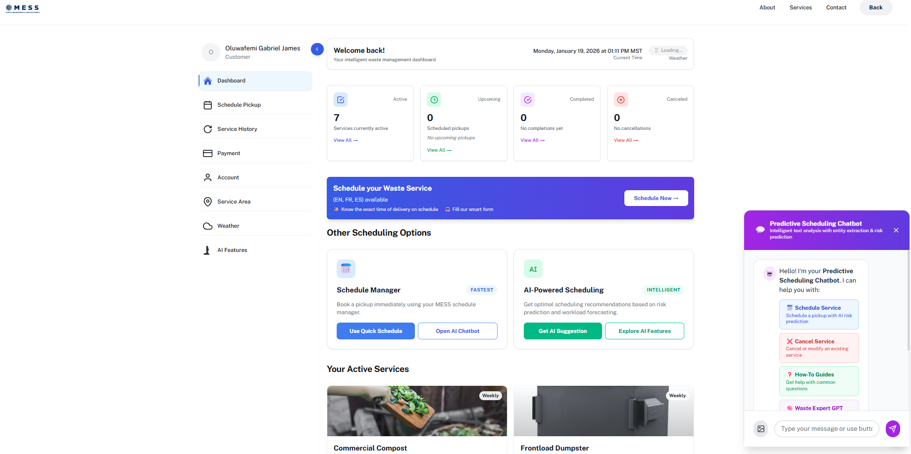
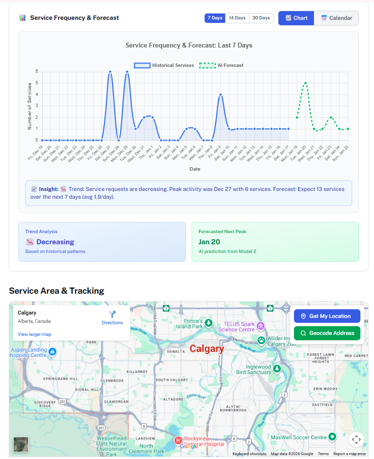
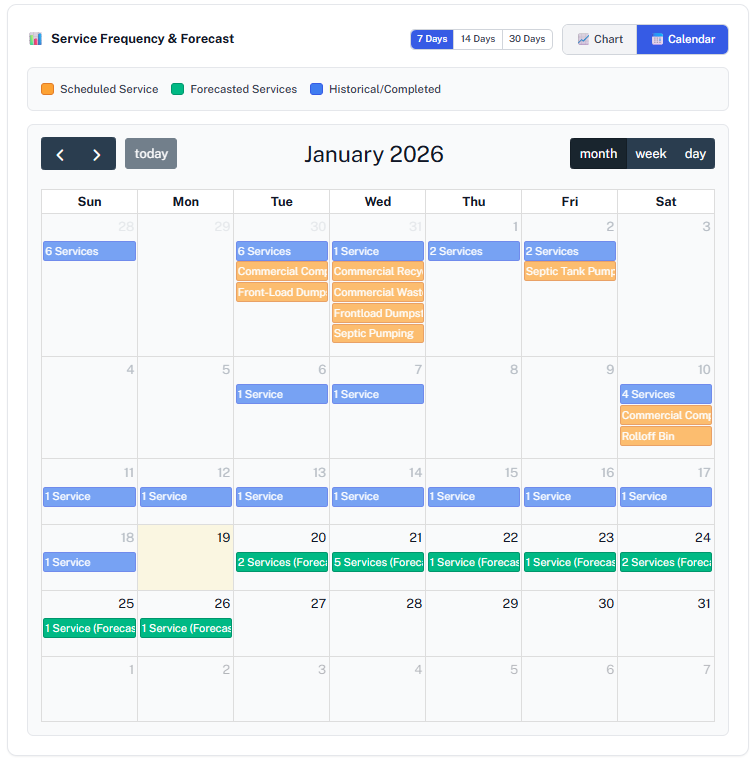
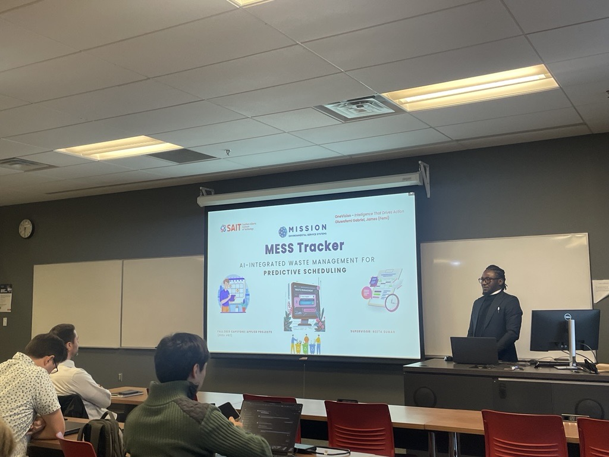
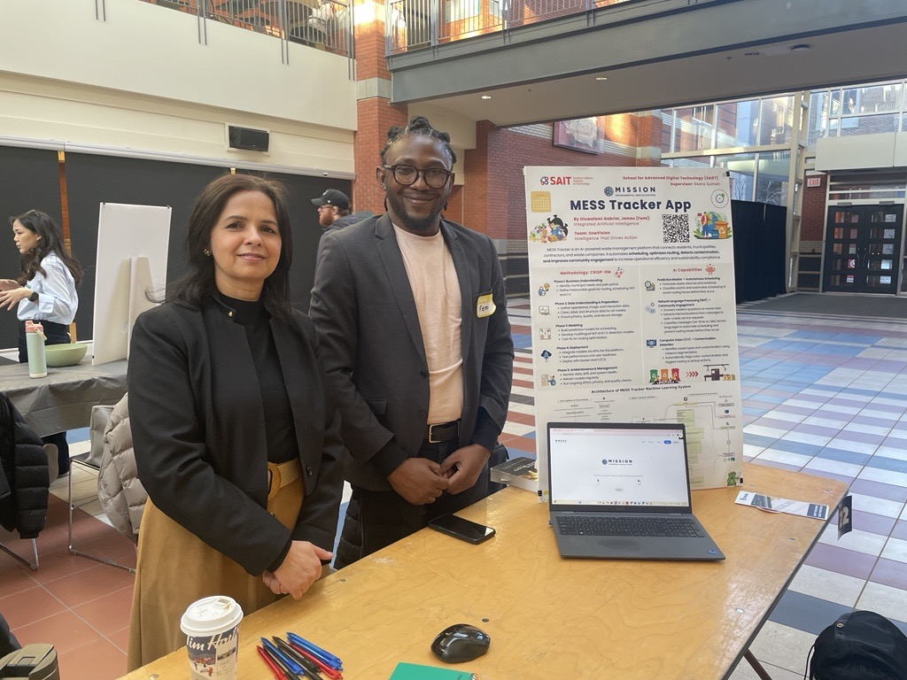
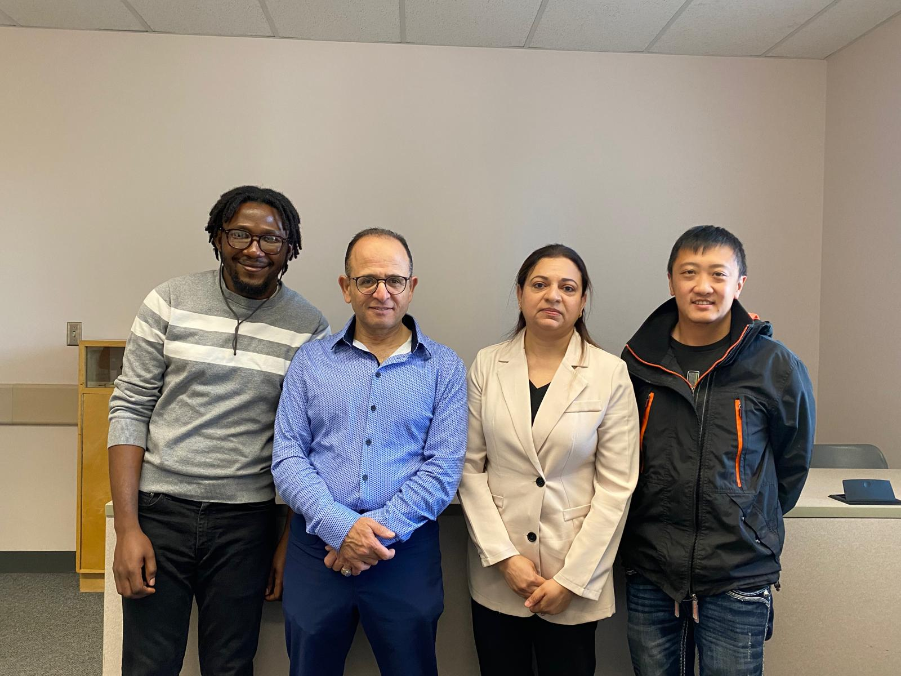
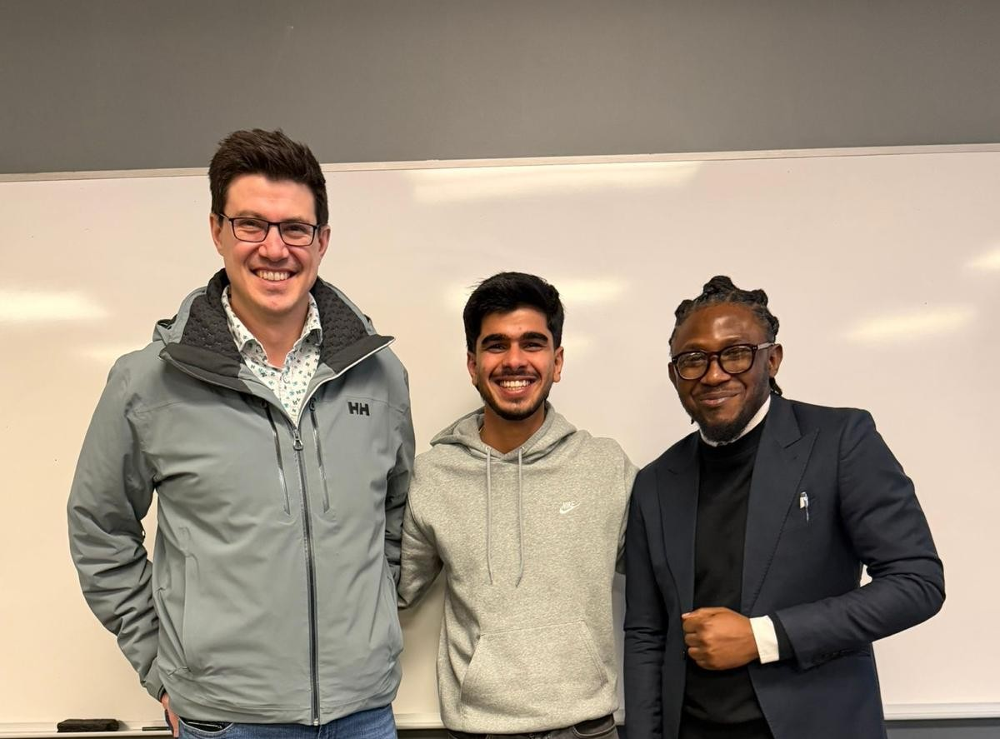

  <h1 style="margin-bottom: 25px;">I engineer AI digital operating systems that turn manual industries into AI-driven markets.</h1>
   
  

    I use <strong>Full-Stack Engineering</strong> to bridge the critical gap between <strong>Customer Demand</strong> and <strong>Operational Execution.</strong> I do it with governance, scalability, and ethics built in.
  

  

    <ul style="margin: 0; padding-left: 20px; list-style-type: none;">
       
      <li style="margin-bottom: 15px; display: flex; align-items: flex-start;">
        
        
          <strong>The Infrastructure:</strong> I architect <strong>multi-tenant, asset-light systems</strong> that scale without overhead.
        
      </li>

      <li style="margin-bottom: 15px; display: flex; align-items: flex-start;">
        
        
          <strong>The Connective Tissue:</strong> I deploy <strong>NLP, Computer Vision, and Predictive Models</strong> (Regression, Classification, Time-Series) to automate decisions.
        
      </li>

      <li style="margin-bottom: 0; display: flex; align-items: flex-start;">
        
        
          <strong>The Outcome:</strong> I build platforms that autonomously orchestrate logistics, secure revenue streams, and <strong>dominate markets</strong>.
        
      </li>

    </ul>
  

  

    

      <h2 style="margin-bottom: 5px; color: #24292e;">Flagship Platform: MESS Tracker</h2>
      
The Asset-Light Operating System for Waste Management

    

  

  

    
    

      MESS Tracker is a <strong>multi-tenant SaaS marketplace</strong> that digitizes the entire waste service lifecycle. It serves as a centralized operating system, replacing fragmented, manual workflows with an intelligent, data-driven platform that connects demand, dispatch, and execution.
    

    <h3 style="border-bottom: 1px solid #eaecef; padding-bottom: 10px; margin-top: 40px;">System Architecture: The "Three-Gate" Model</h3>
     
    

       
      

        <h4 style="margin-top: 0; color: #24292e;">🔐 Zero-Trust Security</h4>
        

          Implemented a <strong>Three-Gate Architecture</strong>  to strictly isolate:
           • <strong>Public Users</strong> (Magic Link Auth)
           • <strong>Internal Ops</strong> (2FA Fortress)
           • <strong>Drivers</strong> (Device-Bound Tokens)
        

      

      

        <h4 style="margin-top: 0; color: #24292e;">💾 The "Jukebox" Data Model</h4>
        

          Designed a hierarchical relational model separating <strong>Service Definitions</strong> from <strong>Tenant Availability</strong>. 
            
          The system orchestrates <strong>98+ micro-services</strong> and <strong>18+ core clusters</strong> across <strong>8+ tenants</strong> , utilizing <strong>Redis</strong> to serve <strong>10,000+ cached keys</strong>  with <strong>millisecond latency</strong>.
        

      

    

    

      Python (Django)
      PostgreSQL (Multi-tenant)
      Redis (Broker)
      Celery (Async)
      Docker
    

    

      
      

        <strong>Figure 1:</strong> The "End-to-End" Orchestration Flow: Connecting Demand Creation to Settlement.
      

    

    

      

        <h2 style="margin-bottom: 5px;">AI as Infrastructure</h2>
        
Operational Intelligence (Not a Feature)

      

      

        AI inside MESS Tracker is an <strong>operational infrastructure</strong> embedded directly into the "Three-Gate" workflow. It coordinates <strong>Vision, Language (Multilingual), Risk-analysis (Regression/Classification), and Time-Series</strong> intelligence to automate logistics.
      

      

        
        

          <strong>Figure 2: The ML Pipeline.</strong> Data ingestion (ETL), Multi-model training (RoBERTa, YOLOv11, LSTM), and Cloud Deployment.
        

      

      <h3 style="border-bottom: 1px solid #eaecef; padding-bottom: 10px; margin-bottom: 20px;">Implemented Capabilities</h3>

      

        

          <h4 style="margin-top: 0; color: #24292e;">💬 NLP & Transformers</h4>
          

            <strong>Intent Recognition:</strong> Acts as the "Front Door," routing unstructured requests to DB tables.
          

          

            RoBERTa
            SpaCy
            GPT-2
          

        

        

          <h4 style="margin-top: 0; color: #24292e;">👁️ Computer Vision</h4>
          

            <strong>Automated Inspection:</strong> Real-time waste classification and contamination detection.
          

          

            YOLOv11
            Segmentation
            OpenCV
          

        

        

          <h4 style="margin-top: 0; color: #24292e;">📈 Predictive Ops</h4>
          

            <strong>Demand Forecasting:</strong> Predicting operational load to optimize driver scheduling.
          

          

            SARIMA
            LSTM / GRU
          

        

      

    

  

  

    
    

      <h2 style="margin-bottom: 5px;">🎨 Frontend & Execution</h2>
      
From Insight to Automation

    

    

      The User Interface is the bridge between the AI models and the real world. Below is the operational workflow: <strong>Dashboarding → Predictive Planning → AI Automation → Final Dispatch.</strong>
    

     
    

      👆 Tap any slide below to view full screen
    

    

       
      

        
        

          <strong style="color: #24292e;">1. User Command Center</strong> 
          Service shortcuts and a Multilingual AI Chatbot.
        

      

      

        
        

          <strong style="color: #0366d6;">2. Live Analytics & Forecasts</strong> 
          7/14/30-day demand forecasting models.
        

      

      

        
        

          <strong style="color: #0366d6;">3. Smart Scheduling Calendar</strong> 
          Risk Analysis based scheduling.
        

      

      

        <video class="lazy-video" muted loop playsinline controls poster="assets/images/user_service_calendar.png" style="width: 100%; display: block; pointer-events: none;">
          <source data-src="assets/videos/predictive_scheduling.mp4" type="video/mp4">
        </video>
        

          <strong style="color: #d03801;">4. Demo: Predictive Scheduling</strong> 
          Processing structured data to suggest slots.
        

      

      

        <video class="lazy-video" muted loop playsinline controls poster="assets/images/user_dashboard_overview.png" style="width: 100%; display: block; pointer-events: none;">
          <source data-src="assets/videos/nlp_scheduling.mp4" type="video/mp4">
        </video>
        

          <strong style="color: #d03801;">5. Demo: NLP Scheduling</strong> 
          Converting text requests into events.
        

      

      

        <video class="lazy-video" muted loop playsinline controls poster="assets/images/user_service_analytics.png" style="width: 100%; display: block; pointer-events: none;">
          <source data-src="assets/videos/cv_waste_sorting.mp4" type="video/mp4">
        </video>
        

          <strong style="color: #d03801;">6. Demo: Computer Vision</strong> 
          Automated waste identification.
        

      

      

        <video class="lazy-video" muted loop playsinline controls poster="assets/images/user_dashboard_overview.png" style="width: 100%; display: block; pointer-events: none;">
          <source data-src="assets/videos/dispatch_management.mp4" type="video/mp4">
        </video>
        

          <strong style="color: #159957;">7. Demo: Dispatch Execution</strong> 
          Routing the finalized task.
        

      

    

    

      (Swipe right to view AI Demos & Dispatch Video) →
    

  

  

    &times;
    

  

  

  

    
    

      <h2 style="margin-bottom: 5px;">🏆 Real-World Impact</h2>
      
Beyond Localhost: Defense & Recognition

    

    

      MESS Tracker wasn't just a theoretical exercise. It was a rigorous Capstone project that involved <strong>academic defense, stakeholder presentations, and public showcasing</strong>. It stands as a proof-of-concept for how AI can tangibly modernize municipal infrastructure.
    

    

      

        
        

          <strong style="color: #6f42c1;">1. The Technical Defense</strong>
          

            Presenting the "Three-Gate" Architecture and AI Integration strategy to the review board.
          

        

      

      

        
        

          <strong style="color: #6f42c1;">2. Industry Showcase</strong>
          

            Demonstrating the live MVP alongside Project Supervisor, Reeta Suman, at the Capstone Exhibition.
          

        

      

      

        

           
          

            <h3 style="margin-top: 0; color: #24292e;">📜 Official Project Poster</h3>
            

              The comprehensive breakdown of the <strong>CRISP-DM Methodology</strong> used to build MESS Tracker. 
            

            <ul style="font-size: 0.9rem; color: #586069; margin-bottom: 20px;">
              <li><strong>Methodology:</strong> Phase 1-5 (Business Understanding to Maintenance)</li>
              <li><strong>Tech Stack:</strong> Django, YOLOv11, LSTM, SARIMA</li>
              <li><strong>Outcome:</strong> A scalable, AI-driven operating system.</li>
            </ul>
            <a href="assets/images/mess_poster.png" target="_blank" class="btn" style="font-size: 0.9rem; background-color: #6f42c1; color: white; padding: 12px 24px; border-radius: 6px; text-decoration: none; display: inline-block; font-weight: 600; box-shadow: 0 2px 5px rgba(0,0,0,0.2); transition: all 0.2s ease-in-out;">
  View Full Size Poster →
</a>
          

          

            
          

        

      

    

  

  
 

  

    

      <h2 style="margin-bottom: 5px; color: #24292e;">Collaborative AI: StrokeRisk System</h2>
      
Clinical Decision Support & MLOps Governance

    

  

  

  
    

      

        <strong>The Leadership Context:</strong> While MESS Tracker showcases my solo architectural skills, StrokeRisk demonstrates my ability to lead and integrate within high-performance teams. 
          
        Leading <strong>Group 4 (G4 Pulse): Fuad, Preston and Marrium in our first semester</strong> for development and <strong>Group 2 (G2): Kevin and Shalin in our second semester </strong> for MLOps, I orchestrated the transition from a raw dataset to a governed, FDA-aligned deployment. We moved beyond "just coding" to building a compliant, auditable lifecycle.
      

    

    

      StrokeRisk is an end-to-end clinical decision-support system built using the <strong>CRISP-DM Methodology</strong>. It leverages a <strong>Soft-Voting Ensemble Model</strong> to predict stroke probability with high recall, ensuring high-risk patients are identified early.
    

    

      

        

          <h3 style="margin: 0; font-size: 1.1rem; color: #24292e;">⚙️ Phase 1: The Ensemble Innovation</h3>
        

        
        

             
        

        

          

            To tackle the "Accuracy Paradox" in medical AI (where 95% accuracy hides missed diagnoses), we rejected single models in favor of a <strong>Soft-Voting Ensemble</strong>.
          

          
          <ul style="font-size: 0.9rem; margin-bottom: 20px;">
            <li><strong>Data Balancing:</strong> Applied <strong>SMOTE</strong> to correct the 4.9% minority class imbalance, achieving a perfect 50/50 training split.</li>
            <li><strong>The Architectures:</strong> Aggregated <strong>Random Forest, XGBoost, and Extra Trees</strong>.</li>
            <li><strong>The Result:</strong> The ensemble stabilized variance and maximized Recall (Safety).</li>
          </ul>

          

             PyCaret
             SMOTE
             XGBoost
          

        

      

      

        

          <h3 style="margin: 0; font-size: 1.1rem; color: #24292e;">🛡️ Phase 2: Governance-as-Code</h3>
        

        

             
        

        

          

            We didn't just train a model; we built an immutable audit trail using <strong>MLflow</strong> to satisfy <strong>PIPEDA & FDA SaMD</strong> reproducibility guidelines.
          

          
          <ul style="font-size: 0.9rem; margin-bottom: 20px;">
            <li><strong>Reproducibility:</strong> Enforced `conda.yaml` environment locking to prevent dependency drift.</li>
            <li><strong>Auditability:</strong> Every run logged Git Hashes, Dataset Digests, and Parameters.</li>
            <li><strong>Gated Promotion:</strong> Implemented a strict <em>Staging &rarr; Production</em> workflow requiring governance approval.</li>
          </ul>

          

             MLflow
             CI/CD
             Audit Logs
          

        

      

    

    <h3 style="border-bottom: 1px solid #eaecef; padding-bottom: 10px; margin-top: 40px; margin-bottom: 20px;">🏆 Validated Performance</h3>

    

      
      

        
95.8%

        
Accuracy

      

      

        
0.992

        
AUC Score

      

      

        
96.5%

        
Recall (Safety)

      

    

    

      

        
        

          <h3 style="margin-top: 0; color: #24292e;">Cloud Deployment</h3>
          

            The final system was deployed on <strong>Streamlit Cloud</strong>, serving the MLflow-registered model via a REST API. The frontend was designed using <strong>Human-Centered Design</strong> principles (Fogg Behavior Model) to ensure clinician trust.
          

          

            <strong>Features Implemented:</strong>
             • Real-time Risk Assessment
             • SHAP-based Explainability (Why did the model say yes?)
             • PDF Report Generation
          

          

            
            <a href="https://strokerisktool.streamlit.app/Patient_Data_Entry" target="_blank" class="btn" style="background-color: #0366d6; color: #ffffff; padding: 10px 20px; border-radius: 6px; text-decoration: none; font-weight: 600; display: inline-block; box-shadow: 0 2px 4px rgba(0,0,0,0.1);">
              Launch Live App 🚀
            </a>

            <a href="https://github.com/FemiJames070/StrokeRisk_Tool/" target="_blank" style="color: #0366d6; text-decoration: none; font-weight: 600;">
              View GitHub Repo →
            </a>

        

        

        

        
        

          <video class="lazy-video" width="100%" height="auto" controls muted playsinline poster="assets/images/strokerisk_ui_preview.png">
            <source data-src="assets/videos/strokerisk_demo.mp4" type="video/mp4">
            Your browser does not support the video tag.
          </video>
        

        

          <strong>Figure 3:</strong> Live Demo: The Clinician Dashboard & Explainable AI
        

      

      

    

  
 

  
  <h2 style="color: #24292e; margin-top: 0; margin-bottom: 15px; font-size: 2rem;">Ready to build for the real world?</h2>
  
  

    I am currently based in <strong>Calgary, AB</strong> and available for  
    <strong style="color: #0366d6;">Senior Engineering & Platform Leadership</strong> roles.
  

  
  

    
    <a href="mailto:femijames070@gmail.com" class="btn" style="background-color: #24292e; color: #ffffff; padding: 12px 28px; border-radius: 6px; text-decoration: none; font-weight: 600; font-size: 1.05rem; box-shadow: 0 4px 6px rgba(0,0,0,0.1); transition: transform 0.2s ease;">
      📬 Send me an Email
    </a>

    <a href="https://www.linkedin.com/in/femijames/" target="_blank" class="btn" style="background-color: #ffffff; color: #0077b5; border: 1px solid #0077b5; padding: 12px 28px; border-radius: 6px; text-decoration: none; font-weight: 600; font-size: 1.05rem; box-shadow: 0 2px 4px rgba(0,0,0,0.05); transition: background-color 0.2s ease;">
      in Connect on LinkedIn
    </a>

  

